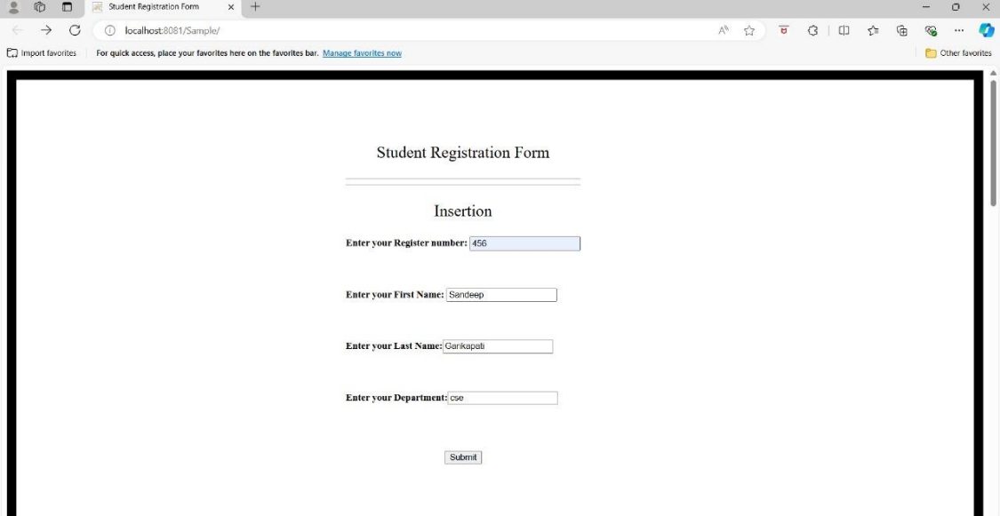
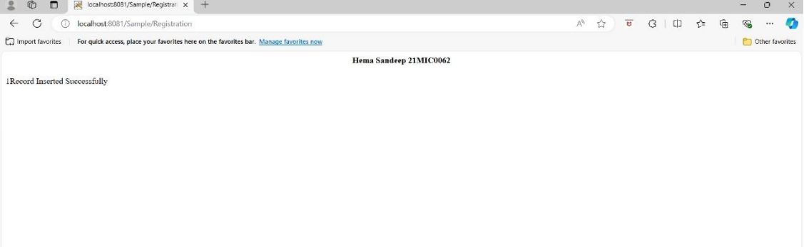
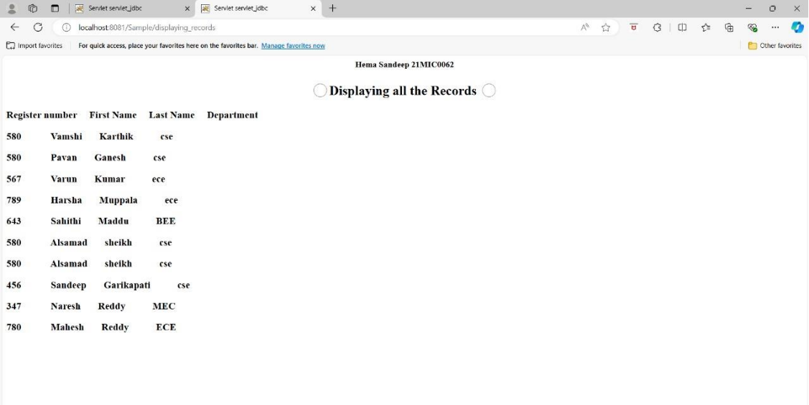
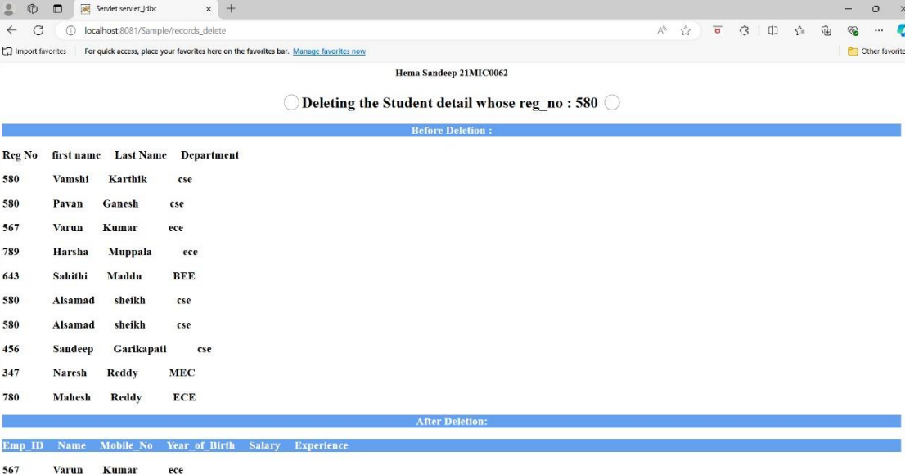

# File name : Index.html

```html
<!DOCTYPE html>
<html lang="en">

<head>
  <meta charset="UTF-8">
  <meta name="viewport" content="width=device-width, initial-scale=1.0">
  <title>Employee Registration Form</title>
  <style>
    body {
      border: 15px solid #333;
      background-color: #f2f2f2;
      display: flex;
      flex-direction: column;
      align-items: center;
      padding: 20px;
      margin: 0;
    }

    form {
      font-size: 15px;
      margin: 1.5% 0;
      width: 80%;
      max-width: 600px;
      padding: 50px;
      border-radius: 8px;
      box-shadow: 0 0 10px rgba(0, 0, 0, 0.2);
      background-color: #fff;
    }

    .form-header {
      color: #ffffff;
      text-align: center;
      font-size: 25px;
      padding: 10px;
      border-radius: 4px;
      margin-bottom: 20px;
    }

    .insertion {
      background-color: #d1c4e9;
    }

    .display {
      background-color: #c5e1a5;
    }

    .where-clause {
      background-color: #ffcc80;
    }

    .update {
      background-color: #80deea;
    }

    .delete {
      background-color: #ffab91;
    }

    input[type="submit"] {
      font-size: 15px;
      padding: 10px 20px;
      border: none;
      border-radius: 4px;
      cursor: pointer;
      background-color: #333;
      color: white;
    }

    h4 {
      margin: 10px 0;
    }

    input[type="text"] {
      margin-left: 10px;
    }
  </style>
</head>

<body>

  <!-- Insertion Form -->
  <form action="Emp_insert" method="post" class="insertion">
    <p class="form-header" style="background-color:#7e57c2;">Employee Registration Form - Insertion</p>
    <h4>Enter your Employee ID: <input type="text" name="id"></h4>
    <h4>Enter your Name: <input type="text" name="name"></h4>
    <h4>Enter your Mobile Number: <input type="text" name="mob_no"></h4>
    <h4>Enter your Year of Birth: <input type="text" name="year"></h4>
    <h4>Enter your Salary: <input type="text" name="salary"></h4>
    <h4>Enter your Years of Experience: <input type="text" name="exp"></h4>
    <input type="submit" value="Submit">
  </form>

  <!-- Display All Records Form -->
  <form action="displaying_records" method="post" class="display">
    <p class="form-header" style="background-color:#558b2f;">Employee Registration Form - Displaying All Records</p>
    <input type="submit" value="Display all the Records">
  </form>

  <!-- Display Records with Where Clause Form -->
  <form action="records_where" method="post" class="where-clause">
    <p class="form-header" style="background-color:#ff6f00;">Employee Registration Form - Displaying Using Where Clause</p>
    <h4>Enter the number of years of experience the employee should have or greater than: <input type="text" name="yrs"></h4>
    <input type="submit" value="Submit">
  </form>

  <!-- Update Records Form -->
  <form action="records_update" method="post" class="update">
    <p class="form-header" style="background-color:#00838f;">Employee Registration Form - Updation</p>
    <h4>Enter the number of years of experience greater than: <input type="text" name="yrs"></h4>
    <h4>So that the employee's salary will be increased by: <input type="text" name="bonus"> rupees.</h4>
    <input type="submit" value="Submit">
  </form>

  <!-- Delete Records Form -->
  <form action="records_delete" method="post" class="delete">
    <p class="form-header" style="background-color:#e64a19;">Employee Registration Form - Deletion</p>
    <h4>Enter the ID of Employee to Delete from Employee Database: <input type="text" name="id"></h4>
    <input type="submit" value="Submit">
  </form>

</body>

</html>
```

## File name : Emp_Insert.java

```java
import java.io.IOException;
import java.io.PrintWriter;
import javax.servlet.ServletException;
import javax.servlet.http.HttpServletRequest;
import javax.servlet.http.HttpServletResponse;
import java.sql.Connection;
import java.sql.DriverManager;
import java.sql.PreparedStatement;
import java.sql.SQLException;
import javax.servlet.annotation.WebServlet;
import javax.servlet.http.HttpServlet;

/**
 * @author Ashubala
 */
@WebServlet("/Emp_insert")
public class EmpInsert extends HttpServlet {

    protected void processRequest(HttpServletRequest request, HttpServletResponse response)
            throws ServletException, IOException {
        response.setContentType("text/html;charset=UTF-8");

        try (PrintWriter out = response.getWriter()) {
            out.println("<h4 style=\"text-align:center\">Balaji.M 20MIC0108</h4>");
            out.println("<!DOCTYPE html>");
            out.println("<html>");
            out.println("<head>");
            out.println("<title>Servlet EmpInsert</title>");
            out.println("</head>");
            out.println("<body>");

            try {
                Class.forName("com.mysql.cj.jdbc.Driver");

                try (Connection con = DriverManager.getConnection("jdbc:mysql://localhost:3306/scse", "root", "sandeep")) {
                    String sql = "INSERT INTO employee VALUES (?, ?, ?, ?, ?, ?)";
                    try (PreparedStatement st = con.prepareStatement(sql)) {
                        st.setInt(1, Integer.parseInt(request.getParameter("id")));
                        st.setString(2, request.getParameter("name"));
                        st.setString(3, request.getParameter("mob_no"));
                        st.setString(4, request.getParameter("year"));
                        st.setInt(5, Integer.parseInt(request.getParameter("salary")));
                        st.setInt(6, Integer.parseInt(request.getParameter("exp")));

                        st.executeUpdate();
                        out.println("<h1 style=\"color:rgb(99, 160, 240);text-align:center;font-size:25px;background-color:rgb(243, 115, 179);color:white\">⚪ Successfully Inserted ⚪</h1>");
                    } catch (SQLException e) {
                        out.println("<p>Error executing SQL statement: " + e.getMessage() + "</p>");
                    }
                } catch (SQLException e) {
                    out.println("<p>Error connecting to database: " + e.getMessage() + "</p>");
                }
            } catch (ClassNotFoundException e) {
                out.println("<p>JDBC Driver not found: " + e.getMessage() + "</p>");
            }

            out.println("</body>");
            out.println("</html>");
        }
    }

    @Override
    protected void doGet(HttpServletRequest request, HttpServletResponse response)
            throws ServletException, IOException {
        processRequest(request, response);
    }

    @Override
    protected void doPost(HttpServletRequest request, HttpServletResponse response)
            throws ServletException, IOException {
        processRequest(request, response);
    }

    @Override
    public String getServletInfo() {
        return "Servlet for inserting employee records";
    }
}
```


## File name : Displaying_Records.java

```java
import java.io.IOException;
import java.io.PrintWriter;
import javax.servlet.ServletException;
import javax.servlet.http.HttpServlet;
import javax.servlet.http.HttpServletRequest;
import javax.servlet.http.HttpServletResponse;
import java.sql.Connection;
import java.sql.DriverManager;
import java.sql.ResultSet;
import java.sql.Statement;
import javax.servlet.annotation.WebServlet;

/**
 * @author Ashubala
 */
@WebServlet("/displaying_records")
public class DisplayingRecords extends HttpServlet {

    protected void processRequest(HttpServletRequest request, HttpServletResponse response)
            throws ServletException, IOException {
        response.setContentType("text/html;charset=UTF-8");

        try (PrintWriter out = response.getWriter()) {
            out.println("<h4 style=\"text-align:center\">Balaji.M 20MIC0108</h4>");
            out.println("<!DOCTYPE html>");
            out.println("<html>");
            out.println("<head>");
            out.println("<title>Servlet DisplayingRecords</title>");
            out.println("</head>");
            out.println("<body>");

            try {
                Class.forName("com.mysql.cj.jdbc.Driver"); // Updated driver class
                try (Connection con = DriverManager.getConnection("jdbc:mysql://localhost:3306/scse", "root", "sandeep")) {
                    Statement stmt = con.createStatement();

                    out.println("<h1 style=\"color:rgb(99, 160, 240);text-align:center;font-size:25px;background-color:rgb(243, 115, 179);color:white\">⚪ Displaying all the Records ⚪</h1>");
                    out.println("<h3 style=\"font-style:italic;text-align:center;background-color:rgb(99, 160, 240);color:white\">"
                            + "Emp_ID&nbsp;&nbsp;&nbsp;&nbsp;&nbsp;Name&nbsp;&nbsp;&nbsp;&nbsp;&nbsp;Mobile_No&nbsp;&nbsp;&nbsp;&nbsp;&nbsp;"
                            + "Year_of_Birth&nbsp;&nbsp;&nbsp;&nbsp;&nbsp;Salary&nbsp;&nbsp;&nbsp;&nbsp;&nbsp;Experience"
                            + "</h3>");

                    ResultSet rs = stmt.executeQuery("SELECT * FROM Employee");

                    while (rs.next()) {
                        out.println("<h3>" + rs.getInt(1) + "&nbsp;&nbsp;&nbsp;&nbsp;&nbsp;&nbsp;&nbsp;&nbsp;&nbsp;&nbsp;"
                                + rs.getString(2) + "&nbsp;&nbsp;&nbsp;&nbsp;&nbsp;&nbsp;&nbsp;&nbsp;&nbsp;&nbsp;"
                                + rs.getString(3) + "&nbsp;&nbsp;&nbsp;&nbsp;&nbsp;&nbsp;&nbsp;&nbsp;&nbsp;&nbsp;"
                                + rs.getString(4) + "&nbsp;&nbsp;&nbsp;&nbsp;&nbsp;&nbsp;&nbsp;&nbsp;&nbsp;&nbsp;"
                                + rs.getInt(5) + "&nbsp;&nbsp;&nbsp;&nbsp;&nbsp;&nbsp;&nbsp;&nbsp;&nbsp;&nbsp;"
                                + rs.getInt(6) + "</h3>");
                    }
                } catch (Exception e) {
                    out.println("<p>Error accessing database: " + e.getMessage() + "</p>");
                }
            } catch (ClassNotFoundException e) {
                out.println("<p>JDBC Driver not found: " + e.getMessage() + "</p>");
            }

            out.println("</body>");
            out.println("</html>");
        }
    }

    /**
     * Handles the HTTP <code>GET</code> method.
     *
     * @param request  servlet request
     * @param response servlet response
     * @throws ServletException if a servlet-specific error occurs
     * @throws IOException      if an I/O error occurs
     */
    @Override
    protected void doGet(HttpServletRequest request, HttpServletResponse response)
            throws ServletException, IOException {
        processRequest(request, response);
    }

    /**
     * Handles the HTTP <code>POST</code> method.
     *
     * @param request  servlet request
     * @param response servlet response
     * @throws ServletException if a servlet-specific error occurs
     * @throws IOException      if an I/O error occurs
     */
    @Override
    protected void doPost(HttpServletRequest request, HttpServletResponse response)
            throws ServletException, IOException {
        processRequest(request, response);
    }

    /**
     * Returns a short description of the servlet.
     *
     * @return a String containing servlet description
     */
    @Override
    public String getServletInfo() {
        return "Servlet for displaying employee records";
    }
}
```

## File name : Records_Where.java

```java
import java.io.IOException;
import java.io.PrintWriter;
import javax.servlet.ServletException;
import javax.servlet.http.HttpServlet;
import javax.servlet.http.HttpServletRequest;
import javax.servlet.http.HttpServletResponse;
import java.sql.Connection;
import java.sql.DriverManager;
import java.sql.ResultSet;
import java.sql.Statement;
import javax.servlet.annotation.WebServlet;

/**
 * @author Ashubala
 * NAME: BALAJI.M REG.NO.:20MIC0108
 */
@WebServlet("/records_where")
public class RecordsWhere extends HttpServlet {

    /**
     * Processes requests for both HTTP <code>GET</code> and <code>POST</code> methods.
     *
     * @param request servlet request
     * @param response servlet response
     * @throws ServletException if a servlet-specific error occurs
     * @throws IOException if an I/O error occurs
     */
    protected void processRequest(HttpServletRequest request, HttpServletResponse response)
            throws ServletException, IOException {
        response.setContentType("text/html;charset=UTF-8");
        try (PrintWriter out = response.getWriter()) {
            out.println("<h4 style=\"text-align:center\">Balaji.M 20MIC0108</h4>");
            out.println("<!DOCTYPE html>");
            out.println("<html>");
            out.println("<head>");
            out.println("<title>Servlet servlet_jdbc</title>");
            out.println("</head>");
            out.println("<body>");

            int yrs = Integer.parseInt(request.getParameter("yrs"));

            try {
                Class.forName("com.mysql.cj.jdbc.Driver");
                try (Connection con = DriverManager.getConnection("jdbc:mysql://localhost:3306/scse", "root", "sandeep")) {
                    Statement stmt = con.createStatement();
                    out.println("<h1 style=\"color:rgb(99, 160, 240);text-align:center;font-size: 25px;background-color:rgb(243, 115, 179);color:white\">⚪ Selecting Employee Records where Years of Experience >= " + yrs + " years ⚪</h1>");
                    out.println("<h3 style=\"font-style: italic;text-align: center;background-color:rgb(99, 160, 240);color:white\">Emp_ID&nbsp;&nbsp;&nbsp;&nbsp;&nbsp;Name&nbsp;&nbsp;&nbsp;&nbsp;&nbsp;Mobile_No&nbsp;&nbsp;&nbsp;&nbsp;&nbsp;Year_of_Birth&nbsp;&nbsp;&nbsp;&nbsp;&nbsp;Salary&nbsp;&nbsp;&nbsp;&nbsp;&nbsp;Experience</h3>");

                    ResultSet rs = stmt.executeQuery("SELECT * FROM Employee WHERE Experience >= " + yrs + ";");

                    while (rs.next()) {
                        out.println("<h3>" + rs.getInt(1) + "&nbsp;&nbsp;&nbsp;&nbsp;&nbsp;&nbsp;&nbsp;&nbsp;&nbsp;" + rs.getString(2) + "&nbsp;&nbsp;&nbsp;&nbsp;&nbsp;&nbsp;&nbsp;&nbsp;" + rs.getString(3) + "&nbsp;&nbsp;&nbsp;&nbsp;&nbsp;&nbsp;&nbsp;&nbsp;&nbsp;" + rs.getString(4) + "&nbsp;&nbsp;&nbsp;&nbsp;&nbsp;&nbsp;&nbsp;&nbsp;&nbsp;&nbsp;" + rs.getInt(5) + "&nbsp;&nbsp;&nbsp;&nbsp;&nbsp;&nbsp;&nbsp;&nbsp;&nbsp;&nbsp;" + rs.getInt(6) + "</h3>");
                    }
                } catch (Exception e) {
                    out.println(e);
                }
            } catch (Exception e) {
                out.println(e);
            }

            out.println("</body>");
            out.println("</html>");
        }
    }

    /**
     * Handles the HTTP <code>GET</code> method.
     *
     * @param request servlet request
     * @param response servlet response
     * @throws ServletException if a servlet-specific error occurs
     * @throws IOException if an I/O error occurs
     */
    @Override
    protected void doGet(HttpServletRequest request, HttpServletResponse response)
            throws ServletException, IOException {
        processRequest(request, response);
    }

    /**
     * Handles the HTTP <code>POST</code> method.
     *
     * @param request servlet request
     * @param response servlet response
     * @throws ServletException if a servlet-specific error occurs
     * @throws IOException if an I/O error occurs
     */
    @Override
    protected void doPost(HttpServletRequest request, HttpServletResponse response)
            throws ServletException, IOException {
        processRequest(request, response);
    }

    /**
     * Returns a short description of the servlet.
     *
     * @return a String containing servlet description
     */
    @Override
    public String getServletInfo() {
        return "Short description";
    }
}
```

## File name : records_delete.java

```java
import java.io.IOException;
import java.io.PrintWriter;
import javax.servlet.ServletException;
import javax.servlet.http.HttpServlet;
import javax.servlet.http.HttpServletRequest;
import javax.servlet.http.HttpServletResponse;
import java.sql.Connection;
import java.sql.DriverManager;
import java.sql.ResultSet;
import java.sql.Statement;
import javax.servlet.annotation.WebServlet;

/**
 * Servlet implementation class records_delete
 */
@WebServlet("/records_delete")
public class records_delete extends HttpServlet {

    private static final String JDBC_DRIVER = "com.mysql.cj.jdbc.Driver";
    private static final String DB_URL = "jdbc:mysql://localhost:3306/scse?useSSL=false&serverTimezone=UTC";
    private static final String DB_USER = "root";
    private static final String DB_PASSWORD = "";

    /**
     * Processes requests for both HTTP <code>GET</code> and <code>POST</code> methods.
     *
     * @param request servlet request
     * @param response servlet response
     * @throws ServletException if a servlet-specific error occurs
     * @throws IOException if an I/O error occurs
     */
    protected void processRequest(HttpServletRequest request, HttpServletResponse response)
            throws ServletException, IOException {
        response.setContentType("text/html;charset=UTF-8");
        try (PrintWriter out = response.getWriter()) {
            out.println("<!DOCTYPE html>");
            out.println("<html>");
            out.println("<head>");
            out.println("<title>Delete Employee Record</title>");
            out.println("</head>");
            out.println("<body>");
            out.println("<h4 style=\"text-align:center\">Balaji.M 20MIC0108</h4>");

            int id = Integer.parseInt(request.getParameter("id"));

            try {
                Class.forName(JDBC_DRIVER);
                try (Connection con = DriverManager.getConnection("jdbc:mysql://localhost:3306/scse", "root", "sandeep")) {
                    Statement stmt = con.createStatement();

                    out.println("<h1 style=\"color:rgb(99, 160, 240);text-align: center;font-size: 25px;background-color:rgb(243, 115, 179);color:white\">⚪ Deleting the Employee detail whose ID: " + id + " ⚪</h1>");

                    // Display records before deletion
                    out.println("<h3 style=\"text-align: center;background-color:rgb(99, 160, 240);color:white\">Before Deletion:</h3>");
                    out.println("<h3 style=\"font-style: italic;text-align: center;background-color:rgb(99, 160, 240);color:white\">Emp_ID&nbsp;&nbsp;&nbsp;&nbsp;&nbsp;Name&nbsp;&nbsp;&nbsp;&nbsp;&nbsp;Mobile_No&nbsp;&nbsp;&nbsp;&nbsp;&nbsp;Year_of_Birth&nbsp;&nbsp;&nbsp;&nbsp;&nbsp;Salary&nbsp;&nbsp;&nbsp;&nbsp;&nbsp;Experience</h3>");
                    ResultSet rs = stmt.executeQuery("SELECT * FROM Employee");
                    while (rs.next()) {
                        out.println("<h3>" + rs.getInt(1) + "&nbsp;&nbsp;&nbsp;&nbsp;&nbsp;&nbsp;" +
                                    rs.getString(2) + "&nbsp;&nbsp;&nbsp;&nbsp;&nbsp;" +
                                    rs.getString(3) + "&nbsp;&nbsp;&nbsp;&nbsp;&nbsp;" +
                                    rs.getString(4) + "&nbsp;&nbsp;&nbsp;&nbsp;&nbsp;" +
                                    rs.getInt(5) + "&nbsp;&nbsp;&nbsp;&nbsp;&nbsp;" +
                                    rs.getInt(6) + "</h3>");
                    }

                    // Delete record
                    String sql = "DELETE FROM Employee WHERE id = " + id;
                    stmt.executeUpdate(sql);

                    // Display records after deletion
                    out.println("<h3 style=\"text-align: center;background-color:rgb(99, 160, 240);color:white\">After Deletion:</h3>");
                    out.println("<h3 style=\"font-style: italic;text-align: center;background-color:rgb(99, 160, 240);color:white\">Emp_ID&nbsp;&nbsp;&nbsp;&nbsp;&nbsp;Name&nbsp;&nbsp;&nbsp;&nbsp;&nbsp;Mobile_No&nbsp;&nbsp;&nbsp;&nbsp;&nbsp;Year_of_Birth&nbsp;&nbsp;&nbsp;&nbsp;&nbsp;Salary&nbsp;&nbsp;&nbsp;&nbsp;&nbsp;Experience</h3>");
                    rs = stmt.executeQuery("SELECT * FROM Employee");
                    while (rs.next()) {
                        out.println("<h3>" + rs.getInt(1) + "&nbsp;&nbsp;&nbsp;&nbsp;&nbsp;&nbsp;" +
                                    rs.getString(2) + "&nbsp;&nbsp;&nbsp;&nbsp;&nbsp;" +
                                    rs.getString(3) + "&nbsp;&nbsp;&nbsp;&nbsp;&nbsp;" +
                                    rs.getString(4) + "&nbsp;&nbsp;&nbsp;&nbsp;&nbsp;" +
                                    rs.getInt(5) + "&nbsp;&nbsp;&nbsp;&nbsp;&nbsp;" +
                                    rs.getInt(6) + "</h3>");
                    }
                }
            } catch (Exception e) {
                out.println("<p>Error: " + e.getMessage() + "</p>");
                e.printStackTrace(out);
            }

            out.println("</body>");
            out.println("</html>");
        }
    }

    @Override
    protected void doGet(HttpServletRequest request, HttpServletResponse response)
            throws ServletException, IOException {
        processRequest(request, response);
    }

    @Override
    protected void doPost(HttpServletRequest request, HttpServletResponse response)
            throws ServletException, IOException {
        processRequest(request, response);
    }

    @Override
    public String getServletInfo() {
        return "Servlet that deletes an employee record based on ID";
    }
}

```
## File name : Recordsupdate.java

```java
import java.io.IOException;
import java.io.PrintWriter;

import java.sql.Connection;
import java.sql.DriverManager;
import java.sql.ResultSet;
import java.sql.Statement;

import javax.servlet.ServletException;
import javax.servlet.annotation.WebServlet;
import javax.servlet.http.HttpServlet;
import javax.servlet.http.HttpServletRequest;
import javax.servlet.http.HttpServletResponse;

/**
 * @author Ashubala
 * NAME: BALAJI.M REG.NO.:20MIC0108
 */
@WebServlet("/records_update")
public class RecordsUpdate extends HttpServlet {

    /**
     * Processes requests for both HTTP <code>GET</code> and <code>POST</code> methods.
     *
     * @param request servlet request
     * @param response servlet response
     * @throws ServletException if a servlet-specific error occurs
     * @throws IOException if an I/O error occurs
     */
    protected void processRequest(HttpServletRequest request, HttpServletResponse response)
            throws ServletException, IOException {
        response.setContentType("text/html;charset=UTF-8");
        try (PrintWriter out = response.getWriter()) {
            out.println("<h4 style=\"text-align:center\">Balaji.M 20MIC0108</h4>");
            out.println("<!DOCTYPE html>");
            out.println("<html>");
            out.println("<head>");
            out.println("<title>Servlet servlet_jdbc</title>");
            out.println("</head>");
            out.println("<body>");

            int yrs = Integer.parseInt(request.getParameter("yrs"));
            int bonus = Integer.parseInt(request.getParameter("bonus"));

            try {
                Class.forName("com.mysql.cj.jdbc.Driver");
                try (Connection con = DriverManager.getConnection("jdbc:mysql://localhost:3306/scse", "root", "sandeep")) {
                    Statement stmt = con.createStatement();
                    out.println("<h1 style=\"color:rgb(99, 160, 240);text-align:center;font-size: 25px;background-color:rgb(243, 115, 179);color:white\">⚪ Updating the Salary of Employees by " + bonus + " rupees whose Experience > " + yrs + " years ⚪</h1>");

                    ResultSet rs = stmt.executeQuery("SELECT * FROM Employee;");
                    out.println("<h3 style=\"text-align: center;background-color:rgb(99, 160, 240);color:white\">Before Updation of Salaries:</h3>");
                    out.println("<h3 style=\"font-style: italic;text-align: center;background-color:rgb(99, 160, 240);color:white\">Emp_ID&nbsp;&nbsp;&nbsp;&nbsp;&nbsp;Name&nbsp;&nbsp;&nbsp;&nbsp;&nbsp;Mobile_No&nbsp;&nbsp;&nbsp;&nbsp;&nbsp;Year_of_Birth&nbsp;&nbsp;&nbsp;&nbsp;&nbsp;Salary&nbsp;&nbsp;&nbsp;&nbsp;&nbsp;Experience</h3>");

                    while (rs.next()) {
                        out.println("<h3>" + rs.getInt(1) + "&nbsp;&nbsp;&nbsp;&nbsp;&nbsp;&nbsp;&nbsp;&nbsp;&nbsp;" + rs.getString(2) + "&nbsp;&nbsp;&nbsp;&nbsp;&nbsp;&nbsp;&nbsp;&nbsp;" + rs.getString(3) + "&nbsp;&nbsp;&nbsp;&nbsp;&nbsp;&nbsp;&nbsp;&nbsp;&nbsp;" + rs.getString(4) + "&nbsp;&nbsp;&nbsp;&nbsp;&nbsp;&nbsp;&nbsp;&nbsp;&nbsp;&nbsp;" + rs.getInt(5) + "&nbsp;&nbsp;&nbsp;&nbsp;&nbsp;&nbsp;&nbsp;&nbsp;&nbsp;&nbsp;" + rs.getInt(6) + "</h3>");
                    }

                    String sql = "UPDATE Employee SET salary = salary + " + bonus + " WHERE Experience > " + yrs + ";";
                    stmt.executeUpdate(sql);

                    rs = stmt.executeQuery("SELECT * FROM Employee;");
                    out.println("<h3 style=\"text-align: center;background-color:rgb(99, 160, 240);color:white\">After Updation of Salaries:</h3>");
                    out.println("<h3 style=\"font-style: italic;text-align: center;background-color:rgb(99, 160, 240);color:white\">Emp_ID&nbsp;&nbsp;&nbsp;&nbsp;&nbsp;Name&nbsp;&nbsp;&nbsp;&nbsp;&nbsp;Mobile_No&nbsp;&nbsp;&nbsp;&nbsp;&nbsp;Year_of_Birth&nbsp;&nbsp;&nbsp;&nbsp;&nbsp;Salary&nbsp;&nbsp;&nbsp;&nbsp;&nbsp;Experience</h3>");

                    while (rs.next()) {
                        out.println("<h3>" + rs.getInt(1) + "&nbsp;&nbsp;&nbsp;&nbsp;&nbsp;&nbsp;&nbsp;&nbsp;&nbsp;" + rs.getString(2) + "&nbsp;&nbsp;&nbsp;&nbsp;&nbsp;&nbsp;&nbsp;&nbsp;" + rs.getString(3) + "&nbsp;&nbsp;&nbsp;&nbsp;&nbsp;&nbsp;&nbsp;&nbsp;&nbsp;" + rs.getString(4) + "&nbsp;&nbsp;&nbsp;&nbsp;&nbsp;&nbsp;&nbsp;&nbsp;&nbsp;&nbsp;" + rs.getInt(5) + "&nbsp;&nbsp;&nbsp;&nbsp;&nbsp;&nbsp;&nbsp;&nbsp;&nbsp;&nbsp;" + rs.getInt(6) + "</h3>");
                    }
                } catch (Exception e) {
                    out.println(e);
                }
            } catch (Exception e) {
                out.println(e);
            }

            out.println("</body>");
            out.println("</html>");
        }
    }

    /**
     * Handles the HTTP <code>GET</code> method.
     *
     * @param request servlet request
     * @param response servlet response
     * @throws ServletException if a servlet-specific error occurs
     * @throws IOException if an I/O error occurs
     */
    @Override
    protected void doGet(HttpServletRequest request, HttpServletResponse response)
            throws ServletException, IOException {
        processRequest(request, response);
    }

    /**
     * Handles the HTTP <code>POST</code> method.
     *
     * @param request servlet request
     * @param response servlet response
     * @throws ServletException if a servlet-specific error occurs
     * @throws IOException if an I/O error occurs
     */
    @Override
    protected void doPost(HttpServletRequest request, HttpServletResponse response)
            throws ServletException, IOException {
        processRequest(request, response);
    }

    /**
     * Returns a short description of the servlet.
     *
     * @return a String containing servlet description
     */
    @Override
    public String getServletInfo() {
        return "Short description";
    }
}
```

## Output ScreenShots

Insertion


Insertion Confirmation



Display



Delete


