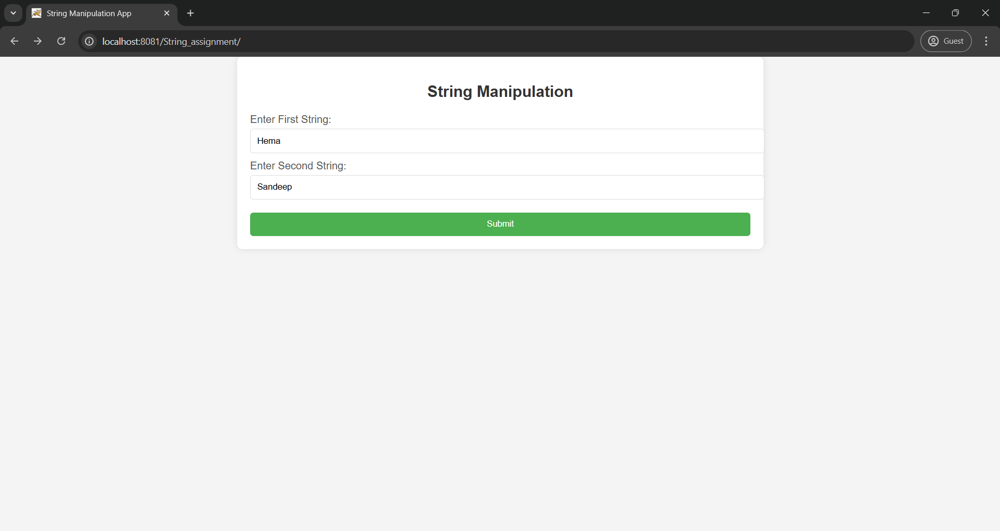
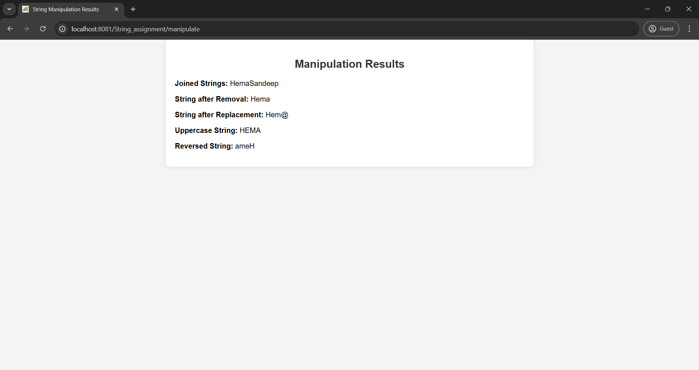

# File name : Index.html
  
  ```html
  <!DOCTYPE html>
<html>
<head>
    <title>String Manipulation App</title>
</head>
<body style="font-family: Arial, sans-serif; background-color: #f4f4f4; margin: 0; padding: 0;">
    <div style="width: 50%; margin: 0 auto; padding: 20px; background-color: #ffffff; border-radius: 8px; box-shadow: 0px 0px 10px 0px rgba(0, 0, 0, 0.1);">
        <h2 style="text-align: center; color: #333;">String Manipulation</h2>
        <form action="manipulate" method="post">
            <label for="string1" style="display: block; margin-top: 10px; color: #555;">Enter First String:</label>
            <input type="text" id="string1" name="string1" required style="width: 100%; padding: 10px; margin-top: 5px; border-radius: 5px; border: 1px solid #ddd;"><br>

            <label for="string2" style="display: block; margin-top: 10px; color: #555;">Enter Second String:</label>
            <input type="text" id="string2" name="string2" required style="width: 100%; padding: 10px; margin-top: 5px; border-radius: 5px; border: 1px solid #ddd;"><br>

            <input type="submit" value="Submit" style="width: 100%; padding: 10px; margin-top: 20px; border-radius: 5px; background-color: #4CAF50; color: white; border: none; cursor: pointer;">
        </form>
    </div>
</body>
</html>

  ```

## File: result.jsp

```jsp
<%-- 
    Document   : result
    Created on : 22 Aug 2024, 10:13:36 pm
    Author     : Sandeepgarikapati
--%>

<%@page contentType="text/html" pageEncoding="UTF-8"%>
<!DOCTYPE html>
<html>
<head>
    <title>String Manipulation Results</title>
</head>
<body style="font-family: Arial, sans-serif; background-color: #f4f4f4; margin: 0; padding: 0;">
    <div style="width: 50%; margin: 0 auto; padding: 20px; background-color: #ffffff; border-radius: 8px; box-shadow: 0px 0px 10px 0px rgba(0, 0, 0, 0.1);">
        <h2 style="text-align: center; color: #333;">Manipulation Results</h2>
        <p><strong>Joined Strings:</strong> ${joined}</p>
        <p><strong>String after Removal:</strong> ${removed}</p>
        <p><strong>String after Replacement:</strong> ${replaced}</p>
        <p><strong>Uppercase String:</strong> ${upperCase}</p>
        <p><strong>Reversed String:</strong> ${reversed}</p>
    </div>
</body>
</html>
```

## File : ServletException.java

```java
/*
 * Click nbfs://nbhost/SystemFileSystem/Templates/Licenses/license-default.txt to change this license
 * Click nbfs://nbhost/SystemFileSystem/Templates/JSP_Servlet/Servlet.java to edit this template
 */
package StringManipulationServlet;


import jakarta.servlet.RequestDispatcher;
import java.io.IOException;
import jakarta.servlet.ServletException;
import jakarta.servlet.annotation.WebServlet;
import jakarta.servlet.http.HttpServlet;
import jakarta.servlet.http.HttpServletRequest;
import jakarta.servlet.http.HttpServletResponse;

@WebServlet("/manipulate")
public class StringManipulationServlet extends HttpServlet {
    @Override
    protected void doPost(HttpServletRequest request, HttpServletResponse response) 
            throws ServletException, IOException {

        String string1 = request.getParameter("string1");
        String string2 = request.getParameter("string2");

        // String Manipulations
        String joined = string1 + string2;
        String removed = string1.replaceAll(string2, "");
        String replaced = string1.replace('a', '@'); // Example replacement
        String upperCase = string1.toUpperCase();
        String reversed = new StringBuilder(string1).reverse().toString();

        request.setAttribute("joined", joined);
        request.setAttribute("removed", removed);
        request.setAttribute("replaced", replaced);
        request.setAttribute("upperCase", upperCase);
        request.setAttribute("reversed", reversed);

        RequestDispatcher rd = request.getRequestDispatcher("/result.jsp");
        rd.forward(request, response);
    }

```

## Example Images


