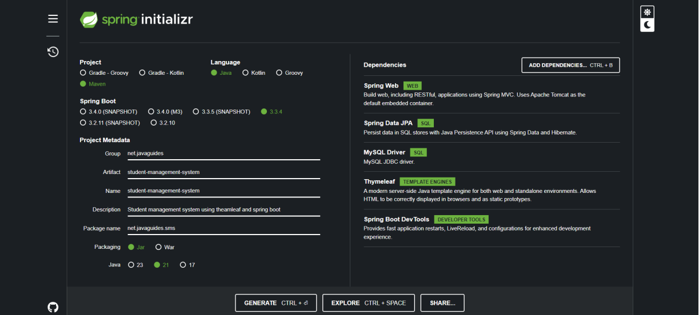

# Student Management System

This is the code using spring

## File name : StudentController.java

```java
package net.javaguides.sms.controller;
import org.springframework.stereotype.Controller;
import org.springframework.ui.Model;
import org.springframework.web.bind.annotation.GetMapping;
import org.springframework.web.bind.annotation.ModelAttribute;
import org.springframework.web.bind.annotation.PathVariable;
import org.springframework.web.bind.annotation.PostMapping;
import net.javaguides.sms.entity.Student;
import net.javaguides.sms.service.StudentService;
@Controller
public class StudentController {
    private final StudentService studentService;
    public StudentController(StudentService studentService) {
        super();
        this.studentService = studentService;
    }
    // handler method to handle list students and return mode and view
    @GetMapping("/students")
    public String listStudents(Model model) {
        model.addAttribute("students", studentService.getAllStudents());
        return "students";
    }
    @GetMapping("/students/new")
    public String createStudentForm(Model model) {

        // create student object to hold student form data
        Student student = new Student();
        model.addAttribute("student", student);
        return "create_student";
    }
    @PostMapping("/students")
    public String saveStudent(@ModelAttribute("student") Student student) {
        studentService.saveStudent(student);
        return "redirect:/students";
    }
    @GetMapping("/students/edit/{id}")
    public String editStudentForm(@PathVariable Long id, Model model) {
        model.addAttribute("student", studentService.getStudentById(id));
        return "edit_student";
    }
    @PostMapping("/students/{id}")
    public String updateStudent(@PathVariable Long id,
                                @ModelAttribute("student") Student student,
                                Model model) {

        // get student from database by id
        Student existingStudent = studentService.getStudentById(id);
        existingStudent.setId(id);
        existingStudent.setFirstName(student.getFirstName());
        existingStudent.setLastName(student.getLastName());
        existingStudent.setEmail(student.getEmail());
        existingStudent.setRegno(student.getRegno());

        // save updated student object
        studentService.updateStudent(existingStudent);
        return "redirect:/students";
    }
    @GetMapping("/students/{id}")
    public String deleteStudent(@PathVariable Long id) {
        studentService.deleteStudentById(id);
        return "redirect:/students";
    }
}

```

## File name : Student.java

```java
package net.javaguides.sms.entity;

import jakarta.persistence.*;

@Entity
@Table(name = "students")
public class Student {

    @Id
    @GeneratedValue(strategy = GenerationType.IDENTITY)
    private Long id;

    @Column(name = "first_name", nullable = false)
    private String firstName;

    @Column(name = "last_name")
    private String lastName;

    @Column(name = "email")
    private String email;

    @Column(name = "regno")
    private String regno;

    public Student() {

    }

    public Student(String firstName, String lastName, String email, String regno) {
        super();
        this.firstName = firstName;
        this.lastName = lastName;
        this.email = email;
        this.regno = regno;
    }
    public Long getId() {
        return id;
    }
    public void setId(Long id) {
        this.id = id;
    }
    public String getFirstName() {
        return firstName;
    }
    public void setFirstName(String firstName) {
        this.firstName = firstName;
    }
    public String getLastName() {
        return lastName;
    }
    public void setLastName(String lastName) {
        this.lastName = lastName;
    }
    public String getEmail() {
        return email;
    }
    public void setEmail(String email) {
        this.email = email;
    }

    public String getRegno() {
        return regno;
    }

    public void setRegno(String regno) {
        this.regno = regno;
    }
}
```

## File name : StudentRepository.java

```java
package net.javaguides.sms.repository;

import org.springframework.data.jpa.repository.JpaRepository;

import net.javaguides.sms.entity.Student;

public interface StudentRepository extends JpaRepository<Student, Long>{

}
```


## File name : StudentServiceimplementation.java

```java
package net.javaguides.sms.service.impl;

import java.util.List;

import org.springframework.stereotype.Service;

import net.javaguides.sms.entity.Student;
import net.javaguides.sms.repository.StudentRepository;
import net.javaguides.sms.service.StudentService;

@Service
public class StudentServiceImpl implements StudentService{

    private final StudentRepository studentRepository;

    public StudentServiceImpl(StudentRepository studentRepository) {
        super();
        this.studentRepository = studentRepository;
    }

    @Override
    public List<Student> getAllStudents() {
        return studentRepository.findAll();
    }

    @Override
    public Student saveStudent(Student student) {
        return studentRepository.save(student);
    }

    @Override
    public Student getStudentById(Long id) {
        return studentRepository.findById(id).get();
    }

    @Override
    public Student updateStudent(Student student) {
        return studentRepository.save(student);
    }

    @Override
    public void deleteStudentById(Long id) {
        studentRepository.deleteById(id);
    }

}
```
## Student Service.java

```java
package net.javaguides.sms.service;

import java.util.List;

import net.javaguides.sms.entity.Student;

public interface StudentService {
    List<Student> getAllStudents();

    Student saveStudent(Student student);

    Student getStudentById(Long id);

    Student updateStudent(Student student);

    void deleteStudentById(Long id);
}
```

Now go to resources folder and create a new file called template in that paste this codes

## File name : create_student.html

```html
<!DOCTYPE html>
<html xmlns:th="http://www.thymeleaf.org">
<head>
    <meta charset="ISO-8859-1">
    <title>Student Management System</title>
    <link rel="stylesheet"
          href="https://maxcdn.bootstrapcdn.com/bootstrap/4.0.0/css/bootstrap.min.css"
          integrity="sha384-Gn5384xqQ1aoWXA+058RXPxPg6fy4IWvTNh0E263XmFcJlSAwiGgFAW/dAiS6JXm"
          crossorigin="anonymous">
    <style>
        body {
            background-color: #798645;
            font-family: 'Arial', sans-serif;
        }

        nav.navbar {
            background-color: #343a40;
            padding: 1rem;
        }

        .navbar-brand {
            font-size: 1.5rem;
            font-weight: bold;
        }

        .container {
            margin-top: 30px;
        }

        .card {
            background-color: #ffffff;
            padding: 30px;
            border: none;
            box-shadow: 0 0 15px rgba(0, 0, 0, 0.1);
            border-radius: 12px;
        }

        .card h1 {
            font-size: 2rem;
            margin-bottom: 20px;
            color: #343a40;
        }

        label {
            font-weight: bold;
            font-size: 0.95rem;
        }

        input.form-control {
            border-radius: 8px;
            border: 1px solid #ced4da;
            padding: 10px;
            font-size: 0.95rem;
        }

        input.form-control:focus {
            border-color: #007bff;
            box-shadow: 0 0 10px rgba(0, 123, 255, 0.2);
        }

        .form-group {
            margin-bottom: 20px;
        }

        .box-footer {
            text-align: right;
        }

        button.btn-primary {
            background-color: #007bff;
            border: none;
            padding: 12px 20px;
            font-size: 1rem;
            border-radius: 8px;
            box-shadow: 0 5px 10px rgba(0, 123, 255, 0.3);
            transition: background-color 0.3s ease-in-out, box-shadow 0.3s ease-in-out;
        }

        button.btn-primary:hover {
            background-color: #0056b3;
            box-shadow: 0 7px 15px rgba(0, 123, 255, 0.5);
        }

        button.btn-primary:focus {
            outline: none;
            box-shadow: 0 0 10px rgba(0, 123, 255, 0.5);
        }
    </style>
</head>
<body>
<nav class="navbar navbar-expand-md bg-dark navbar-dark">
    <!-- Brand -->
    <a class="navbar-brand" href="#">Student Management System</a>

    <!-- Toggler/collapsibe Button -->
    <button class="navbar-toggler" type="button" data-toggle="collapse" data-target="#collapsibleNavbar">
        <span class="navbar-toggler-icon"></span>
    </button>

    <!-- Navbar links -->
    <div class="collapse navbar-collapse" id="collapsibleNavbar">
        <ul class="navbar-nav">
            <li class="nav-item">
                <a class="nav-link" th:href="@{/students}">Student Management</a>
            </li>
        </ul>
    </div>
</nav>
<br>
<br>
<div class = "container">
    <div class = "row">
        <div class ="col-lg-6 col-md-6 col-sm-6 container justify-content-center card">
            <h1 class = "text-center"> Create New Student </h1>
            <div class = "card-body">
                <form th:action="@{/students}" th:object = "${student}" method="POST">
                    <div class ="form-group">
                        <label> Student Registration Number </label>
                        <input
                                type = "text"
                                name = "regno"
                                th:field = "*{regno}"
                                class = "form-control"
                                placeholder="Enter Registration number"
                        />
                    </div>
                    <div class ="form-group">
                        <label> Student First Name </label>
                        <input
                                type = "text"
                                name = "firstName"
                                th:field = "*{firstName}"
                                class = "form-control"
                                placeholder="Enter Student First Name"
                        />
                    </div>

                    <div class ="form-group">
                        <label> Student Last Name </label>
                        <input
                                type = "text"
                                name = "lastName"
                                th:field = "*{lastName}"
                                class = "form-control"
                                placeholder="Enter Student Last Name"
                        />
                    </div>

                    <div class ="form-group">
                        <label> Student Email </label>
                        <input
                                type = "text"
                                name = "email"
                                th:field = "*{email}"
                                class = "form-control"
                                placeholder="Enter Student Email"
                        />
                    </div>

                    <div class = "box-footer">
                        <button type="submit" class = "btn btn-primary">
                            Submit
                        </button>
                    </div>
                </form>

            </div>
        </div>
    </div>
</div>
</body>
</html>
```

## File name : edit_student.html

```html
<!DOCTYPE html>
<html xmlns:th="http://www.thymeleaf.org">
<head>
  <meta charset="ISO-8859-1">
  <title>Student Management System</title>
  <link rel="stylesheet"
        href="https://maxcdn.bootstrapcdn.com/bootstrap/4.0.0/css/bootstrap.min.css"
        integrity="sha384-Gn5384xqQ1aoWXA+058RXPxPg6fy4IWvTNh0E263XmFcJlSAwiGgFAW/dAiS6JXm"
        crossorigin="anonymous">
  <style>
    body {
        background-color: #798645;
        font-family: 'Arial', sans-serif;
    }

    nav.navbar {
        background-color: #343a40;
        padding: 1rem;
    }

    .navbar-brand {
        font-size: 1.5rem;
        font-weight: bold;
    }

    .container {
        margin-top: 30px;
    }

    .card {
        background-color: #ffffff;
        padding: 30px;
        border: none;
        box-shadow: 0 0 15px rgba(0, 0, 0, 0.1);
        border-radius: 12px;
    }

    .card h1 {
        font-size: 2rem;
        margin-bottom: 20px;
        color: #343a40;
    }

    label {
        font-weight: bold;
        font-size: 0.95rem;
    }

    input.form-control {
        border-radius: 8px;
        border: 1px solid #ced4da;
        padding: 10px;
        font-size: 0.95rem;
    }

    input.form-control:focus {
        border-color: #007bff;
        box-shadow: 0 0 10px rgba(0, 123, 255, 0.2);
    }

    .form-group {
        margin-bottom: 20px;
    }

    .box-footer {
        text-align: right;
    }

    button.btn-primary {
        background-color: #007bff;
        border: none;
        padding: 12px 20px;
        font-size: 1rem;
        border-radius: 8px;
        box-shadow: 0 5px 10px rgba(0, 123, 255, 0.3);
        transition: background-color 0.3s ease-in-out, box-shadow 0.3s ease-in-out;
    }

    button.btn-primary:hover {
        background-color: #0056b3;
        box-shadow: 0 7px 15px rgba(0, 123, 255, 0.5);
    }

    button.btn-primary:focus {
        outline: none;
        box-shadow: 0 0 10px rgba(0, 123, 255, 0.5);
    }
  </style>
</head>
<body>
<nav class="navbar navbar-expand-md bg-dark navbar-dark">
  <!-- Brand -->
  <a class="navbar-brand" href="#">Student Management System</a>

  <!-- Toggler/collapsibe Button -->
  <button class="navbar-toggler" type="button" data-toggle="collapse" data-target="#collapsibleNavbar">
    <span class="navbar-toggler-icon"></span>
  </button>

  <!-- Navbar links -->
  <div class="collapse navbar-collapse" id="collapsibleNavbar">
    <ul class="navbar-nav">
      <li class="nav-item">
        <a class="nav-link" th:href="@{/students}">Student Management</a>
      </li>
    </ul>
  </div>
</nav>
<br>
<br>
<div class = "container">
  <div class = "row">
    <div class ="col-lg-6 col-md-6 col-sm-6 container justify-content-center card">
      <h1 class = "text-center"> Update Student </h1>
      <div class = "card-body">
        <form th:action="@{/students/{id} (id=${student.id})}" th:object = "${student}" method="POST">
          <div class ="form-group">
            <label> Student Registration number </label>
            <input
                    type = "text"
                    name = "regno"
                    th:field = "*{regno}"
                    class = "form-control"
                    placeholder="Enter registration number"
            />
          </div>
          <div class ="form-group">
            <label> Student First Name </label>
            <input
                    type = "text"
                    name = "firstName"
                    th:field = "*{firstName}"
                    class = "form-control"
                    placeholder="Enter Student First Name"
            />
          </div>

          <div class ="form-group">
            <label> Student Last Name </label>
            <input
                    type = "text"
                    name = "lastName"
                    th:field = "*{lastName}"
                    class = "form-control"
                    placeholder="Enter Student Last Name"
            />
          </div>

          <div class ="form-group">
            <label> Student Email </label>
            <input
                    type = "text"
                    name = "email"
                    th:field = "*{email}"
                    class = "form-control"
                    placeholder="Enter Student Email"
            />
          </div>

          <div class = "box-footer">
            <button type="submit" class = "btn btn-primary">
              Submit
            </button>
          </div>
        </form>

      </div>
    </div>
  </div>
</div>
</body>
</html>
```

## File name : students.html

```html
<!DOCTYPE html>
<html xmlns:th="http://www.thymeleaf.org">
<head>
    <meta charset="ISO-8859-1">
    <title>Student Management System</title>
    <link rel="stylesheet"
          href="https://maxcdn.bootstrapcdn.com/bootstrap/4.0.0/css/bootstrap.min.css"
          integrity="sha384-Gn5384xqQ1aoWXA+058RXPxPg6fy4IWvTNh0E263XmFcJlSAwiGgFAW/dAiS6JXm"
          crossorigin="anonymous">
    <style>
        body {
            background-color: #798645;
            font-family: 'Arial', sans-serif;
        }

        nav.navbar {
            background-color: #343a40;
            padding: 1rem;
        }

        .navbar-brand {
            font-size: 1.5rem;
            font-weight: bold;
        }

        .container {
            margin-top: 30px;
        }

        h1 {
            font-size: 2rem;
            margin-bottom: 20px;
            color: #343a40;
            text-align: center;
        }

        .table {
            background-color: #ffffff;
            border-radius: 8px;
            box-shadow: 0 0 15px rgba(0, 0, 0, 0.1);
        }

        .table thead {
            background-color: #343a40;
            color: #fff;
        }

        .table-striped tbody tr:nth-of-type(odd) {
            background-color: #f2f2f2;
        }

        .table-striped tbody tr:hover {
            background-color: #e9ecef;
        }

        .btn-primary, .btn-danger {
            border-radius: 8px;
            padding: 5px 15px;
            font-size: 0.9rem;
        }

        .btn-primary {
            background-color: #007bff;
            border: none;
            transition: background-color 0.3s ease-in-out, box-shadow 0.3s ease-in-out;
        }

        .btn-primary:hover {
            background-color: #0056b3;
            box-shadow: 0 7px 15px rgba(0, 123, 255, 0.5);
        }

        .btn-danger {
            background-color: #dc3545;
            border: none;
            transition: background-color 0.3s ease-in-out, box-shadow 0.3s ease-in-out;
        }

        .btn-danger:hover {
            background-color: #b52a37;
            box-shadow: 0 7px 15px rgba(220, 53, 69, 0.5);
        }

        .mb-3 {
            margin-bottom: 20px;
        }

        a.btn {
            text-align: center;
            font-weight: bold;
        }
    </style>
</head>

<body>
<nav class="navbar navbar-expand-md bg-dark navbar-dark">
    <!-- Brand -->
    <a class="navbar-brand" href="#">Student Management System</a>

    <!-- Toggler/collapsibe Button -->
    <button class="navbar-toggler" type="button" data-toggle="collapse" data-target="#collapsibleNavbar">
        <span class="navbar-toggler-icon"></span>
    </button>

    <!-- Navbar links -->
    <div class="collapse navbar-collapse" id="collapsibleNavbar">
        <ul class="navbar-nav">
            <li class="nav-item">
                <a class="nav-link" th:href="@{/students}">Student Management</a>
            </li>
            <li class="nav-item">
                <a class="nav-link" th:href="@{/students}">Teacher Management</a>
            </li>
        </ul>
    </div>
</nav>

<div class ="container">
    <div class = "row">
        <h1> List Students </h1>
    </div>

    <div class = "row">
        <div class = "col-lg-3">
            <a th:href = "@{/students/new}" class = "btn btn-primary btn-sm mb-3"> Add Student</a>
        </div>
    </div>
    <table class = "table table-striped table-bordered">
        <thead class = "table-dark">
        <tr>
            <th>Student Registration number</th>
            <th> Student First Name</th>
            <th> Student Last Name</th>
            <th> Student Email </th>
            <th> Actions </th>
        </tr>
        </thead>

        <tbody>
        <tr th:each = "student: ${students}">
            <td th:text = "${student.regno}"></td>
            <td th:text = "${student.firstName}"></td>
            <td th:text = "${student.lastName}"></td>
            <td th:text = "${student.email}"></td>
            <td>
                <a th:href = "@{/students/edit/{id}(id=${student.id})}"
                   class = "btn btn-primary">Update</a>

                <a th:href = "@{/students/{id}(id=${student.id})}"
                   class = "btn btn-danger">Delete</a>

            </td>
        </tr>
        </tbody>

    </table>

</div>
</body>
</html>
```

Now in resources file challed application.properties file and paste this code

```bash
spring.application.name=student-management-system
spring.datasource.url=jdbc:mysql://localhost:3306/serverside?useSSL=false&serverTimezone=UTC&useLegacyDatetimeCode=false
spring.datasource.username=root
spring.datasource.password=sandeep

#Hibernate
spring.jpa.properties.hibernate.dialect = org.hibernate.dialect.MySQLDialect

#Hibernate auto ddl
spring.jpa.hibernate.ddl-auto=update

logging.level.org.hibernate.SQL=DEBUG
```

## File name pom.xml

```xml
<?xml version="1.0" encoding="UTF-8"?>
<project xmlns="http://maven.apache.org/POM/4.0.0" xmlns:xsi="http://www.w3.org/2001/XMLSchema-instance"
	xsi:schemaLocation="http://maven.apache.org/POM/4.0.0 https://maven.apache.org/xsd/maven-4.0.0.xsd">
	<modelVersion>4.0.0</modelVersion>
	<parent>
		<groupId>org.springframework.boot</groupId>
		<artifactId>spring-boot-starter-parent</artifactId>
		<version>3.3.4</version>
		<relativePath/> <!-- lookup parent from repository -->
	</parent>
	<groupId>net.javaguides</groupId>
	<artifactId>student-management-system</artifactId>
	<version>0.0.1-SNAPSHOT</version>
	<name>student-management-system</name>
	<description>Student management system using theamleaf and spring boot</description>
	<url/>
	<licenses>
		<license/>
	</licenses>
	<developers>
		<developer/>
	</developers>
	<scm>
		<connection/>
		<developerConnection/>
		<tag/>
		<url/>
	</scm>
	<properties>
		<java.version>21</java.version>
	</properties>
	<dependencies>
		<dependency>
			<groupId>org.springframework.boot</groupId>
			<artifactId>spring-boot-starter-data-jpa</artifactId>
		</dependency>
		<dependency>
			<groupId>org.springframework.boot</groupId>
			<artifactId>spring-boot-starter-thymeleaf</artifactId>
		</dependency>
		<dependency>
			<groupId>org.springframework.boot</groupId>
			<artifactId>spring-boot-starter-web</artifactId>
		</dependency>

		<dependency>
			<groupId>org.springframework.boot</groupId>
			<artifactId>spring-boot-devtools</artifactId>
			<scope>runtime</scope>
			<optional>true</optional>
		</dependency>
		<dependency>
			<groupId>com.mysql</groupId>
			<artifactId>mysql-connector-j</artifactId>
			<scope>runtime</scope>
		</dependency>
		<dependency>
			<groupId>org.springframework.boot</groupId>
			<artifactId>spring-boot-starter-test</artifactId>
			<scope>test</scope>
		</dependency>
	</dependencies>

	<build>
		<plugins>
			<plugin>
				<groupId>org.springframework.boot</groupId>
				<artifactId>spring-boot-maven-plugin</artifactId>
			</plugin>
		</plugins>
	</build>

</project>

```

Spring Dependencies

Intial Page


Insertion


Inserted File


Update


Delete

