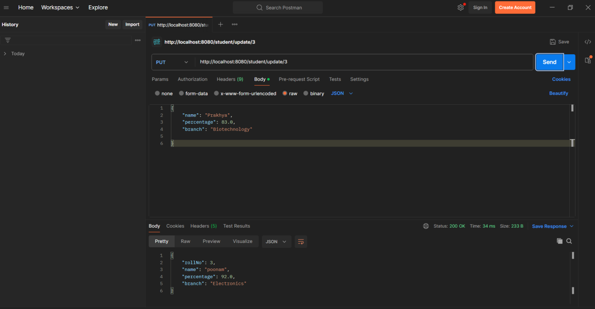

# Data Dependencies

```bash
Spring data JPA
mysql Driver
Spring Web
Spring Boot DevTools
Lombok
```


# File Name: StudentController.java

```java
package com.example.demo.controller;

import java.util.List;

import org.springframework.beans.factory.annotation.Autowired;
import org.springframework.http.HttpStatus;
import org.springframework.http.ResponseEntity;
import org.springframework.web.bind.annotation.DeleteMapping;
import org.springframework.web.bind.annotation.GetMapping;
import org.springframework.web.bind.annotation.PathVariable;
import org.springframework.web.bind.annotation.PostMapping;
import org.springframework.web.bind.annotation.PutMapping;
import org.springframework.web.bind.annotation.RequestBody;
import org.springframework.web.bind.annotation.ResponseStatus;
import org.springframework.web.bind.annotation.RestController;

import com.example.demo.entity.Student;
import com.example.demo.repository.StudentRepository;

@RestController
public class StudentControler {

    @Autowired
    StudentRepository repo;
    //get all the students
    //localhost:8080/students
    @GetMapping("/students")
    public List<Student> getAllStudents(){
        List<Student> students = repo.findAll();
        return students;
    }

    //localhost:8080/students/1
    @GetMapping("/students/{id}")
    public Student getStudent(@PathVariable int id) {
        Student student = repo.findById(id).get();

        return student;

    }

    @PostMapping("/student/add")
    public ResponseEntity<Student> createStudent(@RequestBody Student student) {
        Student newStudent = repo.save(student);
        return ResponseEntity.status(HttpStatus.CREATED).body(newStudent);

    }

    @PutMapping("/student/update/{id}")
    public Student updateStudents(@PathVariable int id) {
        Student student = repo.findById(id).get();
        student.setName("Harshi");
        student.setPercentage(92);
        repo.save(student);
        return student;

    }
    @DeleteMapping("/student/delete/{id}")
    @ResponseStatus(code = HttpStatus.NO_CONTENT)
    public void removeStudent(@PathVariable int id) {
        Student student = repo.findById(id).get();
        repo.delete(student);
    }

}

```

## Files Name: Student.java

```java
package com.example.demo.entity;
import jakarta.persistence.Column;
import jakarta.persistence.Entity;
import jakarta.persistence.GeneratedValue;
import jakarta.persistence.GenerationType;
import jakarta.persistence.Id;
import jakarta.persistence.Table;

@Entity
@Table(name = "student")
public class Student {

    @Id
    @GeneratedValue(strategy = GenerationType.IDENTITY)
    private int rollNo;
    @Column(name = "student_name")
    private String name;
    @Column(name="student_percentage")
    private float percentage;
    @Column(name="student_branch")
    private String branch;

    public Student() {
        // TODO Auto-generated constructor stub
    }


    public Student(String name, float percentage, String branch) {
        super();
        this.name = name;
        this.percentage = percentage;
        this.branch = branch;
    }


    public int getRollNo() {
        return rollNo;
    }
    public void setRollNo(int rollNo) {
        this.rollNo = rollNo;
    }
    public String getName() {
        return name;
    }
    public void setName(String name) {
        this.name = name;
    }
    public float getPercentage() {
        return percentage;
    }
    public void setPercentage(float percentage) {
        this.percentage = percentage;
    }
    public String getBranch() {
        return branch;
    }
    public void setBranch(String branch) {
        this.branch = branch;
    }
    @Override
    public String toString() {
        return "Student [rollNo=" + rollNo + ", name=" + name + ", percentage=" + percentage + ", branch=" + branch
                + "]";
    }

}
```
## File Name: StudentRepository.java

```java
package com.example.demo.repository;

import org.springframework.data.jpa.repository.JpaRepository;

import com.example.demo.entity.Student;

public interface StudentRepository extends JpaRepository<Student, Integer>{

}
```

## Application Properties

```bash
spring.application.name=crudrestapi
spring.datasource.url=jdbc:mysql://localhost:3306/student
spring.datasource.username=root
spring.datasource.password=sandeep
spring.datasource.driver-class-name=com.mysql.cj.jdbc.Driver


spring.jpa.show-sql = true
```

## File name : Pom.xml

```xml
<?xml version="1.0" encoding="UTF-8"?>
<project xmlns="http://maven.apache.org/POM/4.0.0" xmlns:xsi="http://www.w3.org/2001/XMLSchema-instance"
	xsi:schemaLocation="http://maven.apache.org/POM/4.0.0 https://maven.apache.org/xsd/maven-4.0.0.xsd">
	<modelVersion>4.0.0</modelVersion>
	<parent>
		<groupId>org.springframework.boot</groupId>
		<artifactId>spring-boot-starter-parent</artifactId>
		<version>3.3.3</version>
		<relativePath/> <!-- lookup parent from repository -->
	</parent>
	<groupId>com.example</groupId>
	<artifactId>demo</artifactId>
	<version>0.0.1-SNAPSHOT</version>
	<name>crudrestapi</name>
	<description>Demo project for Spring Boot</description>
	<url/>
	<licenses>
		<license/>
	</licenses>
	<developers>
		<developer/>
	</developers>
	<scm>
		<connection/>
		<developerConnection/>
		<tag/>
		<url/>
	</scm>
	<properties>
		<java.version>22</java.version>
	</properties>
	<dependencies>
		<dependency>
			<groupId>org.springframework.boot</groupId>
			<artifactId>spring-boot-starter-data-jpa</artifactId>
		</dependency>
		<dependency>
			<groupId>org.springframework.boot</groupId>
			<artifactId>spring-boot-starter-web</artifactId>
		</dependency>

		<dependency>
			<groupId>org.springframework.boot</groupId>
			<artifactId>spring-boot-devtools</artifactId>
			<scope>runtime</scope>
			<optional>true</optional>
		</dependency>
		<dependency>
			<groupId>com.mysql</groupId>
			<artifactId>mysql-connector-j</artifactId>
			<scope>runtime</scope>
		</dependency>
		<dependency>
			<groupId>org.springframework.boot</groupId>
			<artifactId>spring-boot-starter-test</artifactId>
			<scope>test</scope>
		</dependency>
	</dependencies>

	<build>
		<plugins>
			<plugin>
				<groupId>org.springframework.boot</groupId>
				<artifactId>spring-boot-maven-plugin</artifactId>
			</plugin>
		</plugins>
	</build>

</project>

```


Method: Get


Method: Post


Method : Put


Method: Delete
