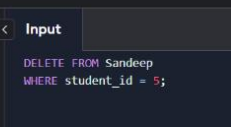

# Create Table


# Insert Data


# Update Data


# Delete Data



## The Essential Fishing Gear

Before we set sail, let's ensure we have all the necessary gear:

- **useState:** The worm that tempts your components to the surface.
- **useEffect:** The lure that attracts side-effects and keeps them at bay.
- **useContext:** The net that gathers global states together, making it easier to share across your component sea.

## Setting Sail: Your First Catch

With our gear ready, it's time to set sail into the React sea. Here's how to make your first catch:

1. **Bait your hook with useState:** Begin by choosing the right worm. `useState` allows you to add state to your functional components, making them more dynamic and responsive.

```jsx
const [fish, setFish] = useState("🐟");
```

2. **Attract with useEffect:** Now, use `useEffect` as your lure. This Hook lets you perform side effects in your components, such as fetching data or subscribing to services. It's like casting your line into the water and waiting for a bite.

```jsx
useEffect(() => {
  console.log(`You've caught ${fish}!`);
}, [fish]);
```

3. **Gather with useContext:** Finally, use `useContext` as your net. This Hook lets you share state across many components without prop drilling. It's like gathering all your catches in one net for a bountiful harvest.

## The Catch of the Day

Congratulations! You've made your first catch in the React sea. But remember, the sea is vast, and there are many more components and hooks to explore. Each project is a new fishing trip, with its challenges and rewards.

Remember to release any components back into the sea if you don't need them. Keeping your application's waters clean and sustainable is key to a healthy React ecosystem.

Happy fishing in the React sea!
